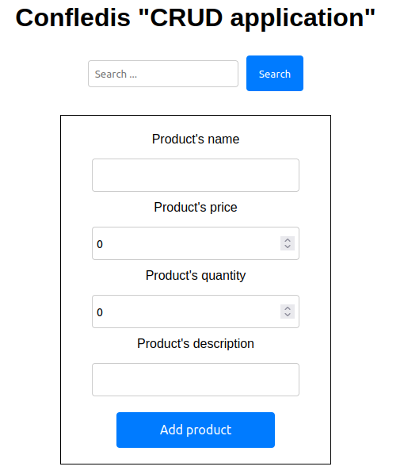
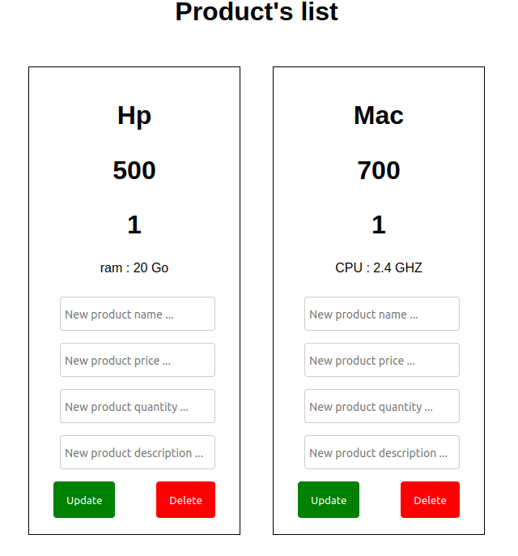

# CRUD Application

## Description

This is a simple CRUD (Create, Read, Update, Delete) application that allows you to manage a list of products. The application is built using React for the frontend and Node.js with Express for the backend. Data is stored in a MongoDB database.

## Features

- Add a new product with name, price, quantity, and description.
- View the list of products and their details.
- Search for products by name.
- Update the details of a product.
- Delete a product from the list.

## Installation

1. Clone the repository to your local machine:

   git clone https://github.com/SWLMadjda/CRUD-application.git

2. Navigate  to the project directory:

    cd CRUD-application-master

3. Install the dependencies for the frontend and backend:

    cd client
    npm install
    cd ../server
    npm install

3. Set up your MongoDB database:

    docker-compose up

##Usage 

1. Start the backend server:

    cd server
    npm start devStart

The backend server will run on http://localhost:8081

2. Start the frontend development server:

    cd client
    npm start

The frontend development server will run on http://localhost:3000 

3. Open your web browser and visit http://localhost:3000 to access the CRUD application.